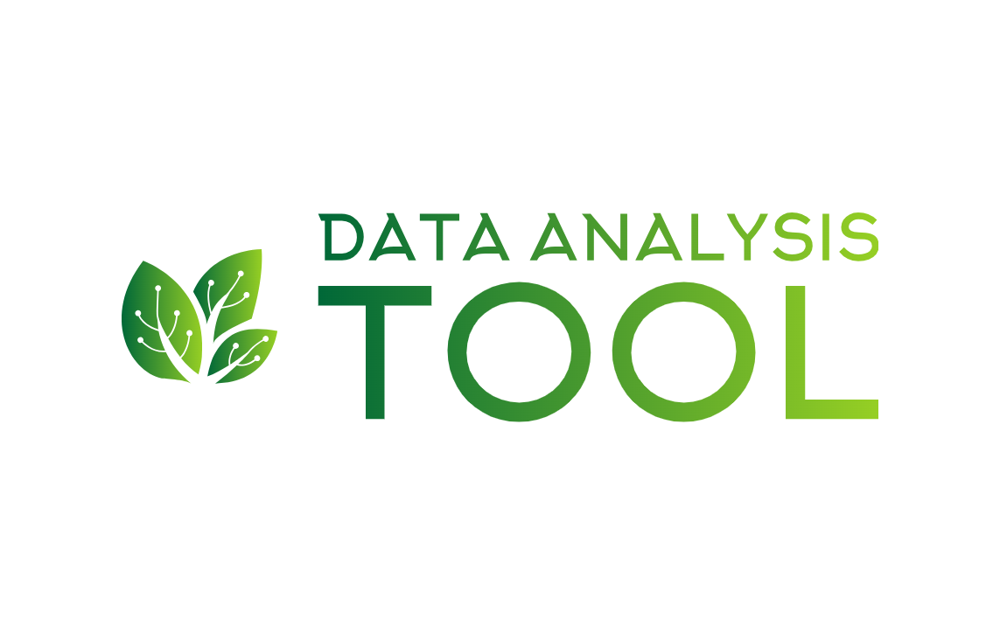

# Data Analysis Tools

 

  

## Inspiration

This repository was born out of a first-year PhD course of mine. As the instructor encouraged us to recommend some data analysis software that would be convenient for engineering students to use, I decided to create a repository to serve as a reference for future engineering students.
